# GIU

  

  <strong>Developer · Local AI · Systems · Automation · Native Software</strong>

  <a href="https://github.com/giu2012">GitHub</a>
  ·
  <a href="https://github.com/giu2012?tab=repositories">Repositories</a>

  
  
  
  
  
  

## Profile

Developer focused on **local-first AI**, agent runtimes, automation, terminal applications and native software.

I build practical systems with an emphasis on clear architecture, understandable tooling, useful interfaces and tested behavior.

## Core stack

**Languages**  
`Python` · `C` · `C++` · `JavaScript` · `TypeScript` · `Swift`

**UI & application**  
`React` · `HTML` · `CSS` · `SwiftUI`

**Systems & AI**  
`macOS` · `Linux` · `Local LLMs` · `Agent runtimes` · `Automation` · `CLI tooling`

## Current focus

| Area | What I build |
| --- | --- |
| **Local AI** | On-device AI workflows, knowledge systems and model tooling |
| **Agents** | Terminal-first runtimes and multi-agent orchestration |
| **Automation** | Practical workflows that stay inspectable and controllable |
| **Native software** | Apple-oriented applications and interfaces |
| **Developer tooling** | CLI utilities, backend components and engineering tools |

## Selected work

Most active projects are currently private while they are being developed and hardened. The public profile is intentionally kept compact rather than linking visitors to inaccessible repositories.

| Project | Direction | Visibility |
| --- | --- | --- |
| `Local_AI_Brain` | Local AI knowledge and tooling | Private |
| `terminal-jarvis-python` | Terminal AI and automation | Private |
| `TUNING-IA` | AI experimentation | Private |
| `CODIFICA-APP` | Developer tooling | Private |
| `LISTATI` | Programming reference material | Private |

## Engineering principles

`Build practical software.`  
`Keep systems understandable.`  
`Test important behavior.`  
`Document assumptions.`

---

  GIU · Developer profile

