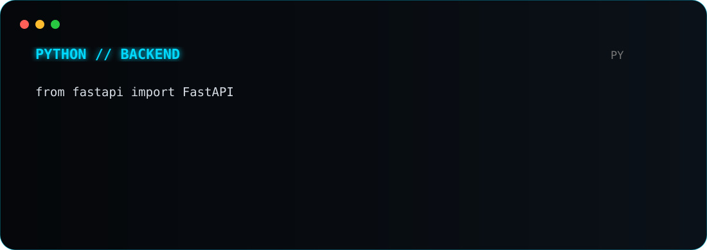
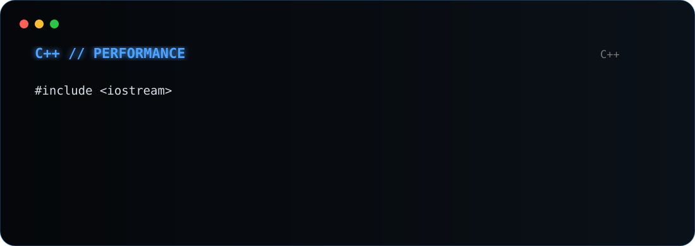
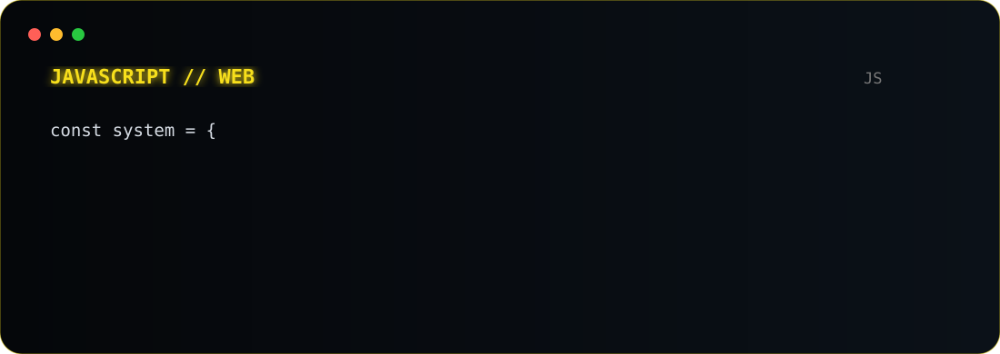
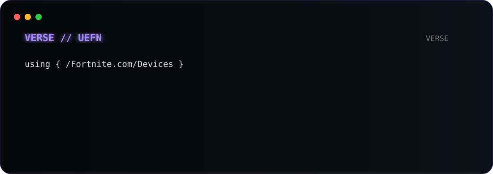

# GIU

<strong>Developer · Local AI · Systems · Automation · Native Software</strong>

<a href="https://github.com/giu2012">GitHub</a> · <a href="https://github.com/giu2012?tab=repositories">Repositories</a> · <a href="https://github.com/giu2012/giu2012">Profile source</a>

  

  

> **I build software that runs close to the machine:** local AI, agent systems, automation, CLI tooling and native applications.

## What I build

| | Area | Direction |
|:---:|---|---|
| **01** | **Local AI** | On-device models, knowledge systems and local-first workflows |
| **02** | **Agent systems** | Terminal-first agents, orchestration and tool execution |
| **03** | **Automation** | Practical workflows designed to stay inspectable and controllable |
| **04** | **Native software** | Apple-oriented applications, interfaces and system tooling |
| **05** | **Developer tooling** | CLI utilities, backends, experiments and engineering tools |

## Stack

**Languages**  
<code>Python</code> · <code>C</code> · <code>C++</code> · <code>JavaScript</code> · <code>TypeScript</code> · <code>Swift</code> · <code>Verse</code>

**Application**  
<code>React</code> · <code>HTML</code> · <code>CSS</code> · <code>SwiftUI</code>

**Systems**  
<code>macOS</code> · <code>Linux</code> · <code>CLI</code> · <code>Backend</code> · <code>Local LLMs</code> · <code>Agent runtimes</code>

## Code in action

<table><tr><td width="50%"></td><td width="50%"></td></tr><tr><td width="50%"></td><td width="50%"></td></tr></table>

## Projects

Most active work is currently private while it is being developed and hardened. Rather than showing broken links, this profile presents the projects by engineering direction.

| Project | Focus | Status |
|---|---|:---:|
| **Local_AI_Brain** | Local AI knowledge, models and tooling | <code>PRIVATE</code> |
| **terminal-jarvis-python** | Terminal AI and automation | <code>PRIVATE</code> |
| **TUNING-IA** | AI experimentation and workflows | <code>PRIVATE</code> |
| **CODIFICA-APP** | Developer tooling | <code>PRIVATE</code> |
| **LISTATI** | Programming references and technical material | <code>PRIVATE</code> |

## Engineering model

<strong>IDEA</strong> → <strong>DESIGN</strong> → <strong>IMPLEMENT</strong> → <strong>TEST</strong> → <strong>HARDEN</strong> → <strong>DOCUMENT</strong>

I prefer systems that are **practical, inspectable, modular and maintainable**.

<strong>Principles</strong>

- Keep architecture understandable.
- Prefer explicit behavior over unnecessary magic.
- Test important paths and edge cases.
- Keep tooling close to the actual workflow.
- Document assumptions before they become bugs.

---

  

GIU · developer profile · built around code, systems and local AI
